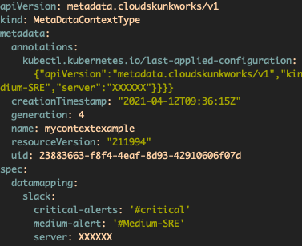

## k8s-workload-metadata-provider

[](https://github.com/AlexsJones/k8s-workload-metadata-provider/actions/workflows/docker-publish.yml)

Built from [KubeOps](https://github.com/AlexsJones/KubeOps)

### Install the Custom Resource Definition on the cluster...

`kubectl apply -f apis/crd.yml`

| TODO                                                         |
|--------------------------------------------------------------|
| Build process for CRD/Annotation                             |
| Update pods through downward API from associated deployments |


### Install the Custom Resource Definition on the cluster...

`kubectl apply -f apis/crd.yml`

### How it works

```go
	err = runtime.EventBuffer(ctx, kubeClient,
		&subscription.Registry{
			Subscriptions: []subscription.ISubscription{
				subscriptions.MetaDataContextSubscriber{},
			},
		}, []watcher.IObject{
			kubeClient.CoreV1().Pods(""),
			metaDataClient.MetaDataContextTypes(""), //Watch for our CRD
		})
```

#### Testing

You can then create an example of this CRD with `kubectl apply -f apis/example-resource.yaml`

_Example running locally_

```
✦ ❯ go run main.go --kubeconfig=/Users/alexjones/.kube/config
I0411 16:17:08.777964   52519 main.go:57] Starting @ 2021-04-11 16:17:08.777878 +0100 BST m=+0.007264668
I0411 16:17:08.777975   52519 main.go:64] Got watcher client...
I0411 16:17:08.779021   52519 main.go:71] Built config from flags...
I0411 16:17:08.780173   52519 main.go:84] Created new KubeConfig
I0411 16:17:08.780207   52519 main.go:101] Starting event buffer...
I0411 16:17:08.788598   52519 metadatacontextsubscriber.go:26] Found MetaDataContextType with message: Test
```

We can see the CRD available here...



