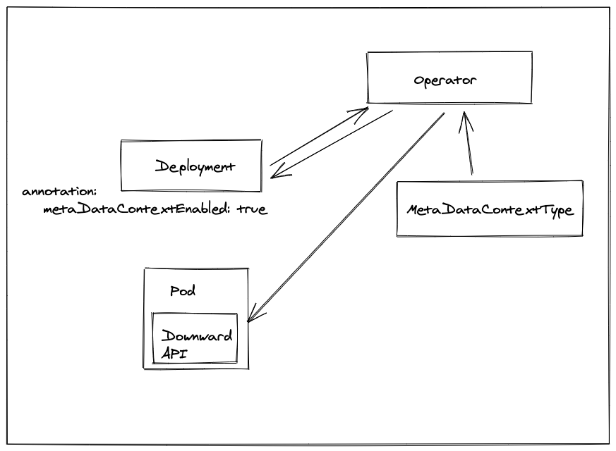

## k8s-workload-metadata-provider

[](https://github.com/AlexsJones/k8s-workload-metadata-provider/actions/workflows/docker-publish.yml)

Built from [KubeOps](https://github.com/AlexsJones/KubeOps)





### Install the Custom Resource Definition on the cluster...

`kubectl apply -f apis/crd.yml`

| TODO                                                         |
|--------------------------------------------------------------|
| Build process for CRD/Annotation                             |
| Update pods through downward API from associated deployments |


### Install the Custom Resource Definition on the cluster...

`kubectl apply -f apis/crd.yml`

| TODO                                                         |
|--------------------------------------------------------------|
| Build process for CRD/Annotation                             |
| Update pods through downward API from associated deployments |


### Install the Custom Resource Definition on the cluster...

`kubectl apply -f apis/crd.yml`

### How it works

```go
// Inject the MetaDataProviderController into the subscriptions

metadataProvider := pkg.MetaDataProviderController{ KubeClient:kubeconfig}
/*
This is a default template file.
Add subscriptions and watchers to make it your own.
*/
err = runtime.EventBuffer(ctx, kubeClient,
&subscription.Registry{
	Subscriptions: []subscription.ISubscription{
	subscriptions.MetaDataContextSubscriber{ MetaDataProvider: metadataProvider  },
	subscriptions.PodSubscriber{ MetaDataProvider: metadataProvider },
},
}, []watcher.IObject{
	kubeClient.CoreV1().Pods(""),
	metaDataClient.MetaDataContextTypes(""), //Watch for our CRD
})
if err != nil {
	klog.Error(err)
}
```

#### Testing

You can then create an example of this CRD with `kubectl apply -f apis/example-resource.yaml`

_Example running locally_

```
❯ go run main.go --kubeconfig=/Users/alexjones/.kube/config
I0412 11:00:23.217006   56851 main.go:57] Starting @ 2021-04-12 11:00:23.216828 +0100 BST m=+0.009834460
I0412 11:00:23.217029   56851 main.go:64] Got watcher client...
I0412 11:00:23.218352   56851 main.go:71] Built config from flags...
I0412 11:00:23.219551   56851 main.go:84] Created new KubeConfig
I0412 11:00:23.219606   56851 main.go:101] Starting event buffer...
I0412 11:00:23.235668   56851 metadatacontextsubscriber.go:26] Found MetaDataContextType with data
I0412 11:00:23.235677   56851 metadatacontextsubscriber.go:29] Key slack: Value: map[critical-alerts:#critical medium-alert:#Medium-SRE server:XXXXXX]
```

We can see the CRD available here...


